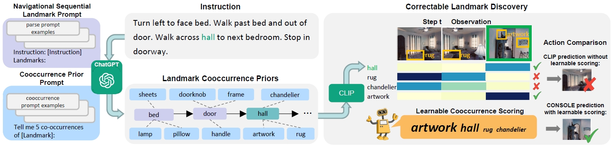

# Correctable Landmark Discovery via Large Models for Vision-Language Navigation

PyTorch implementation of the paper [Correctable Landmark Discovery via Large Models for Vision-Language Navigation](https://arxiv.org/abs/2405.18721).

Vision-Language Navigation (VLN) requires the agent to follow language instructions to reach a target position. A key factor for successful navigation is to align the landmarks implied in the instruction with diverse visual observations. However, previous VLN agents fail to perform accurate modality alignment especially in unexplored scenes, since they learn from limited navigation data and lack sufficient open-world alignment knowledge. In this work, we propose a new VLN paradigm, called COrrectable LaNdmark DiScOvery via Large ModEls (CONSOLE). In CONSOLE, we cast VLN as an open-world sequential landmark discovery problem, by introducing a novel correctable landmark discovery scheme based on two large models ChatGPT and CLIP. Specifically, we use ChatGPT to provide rich open-world landmark cooccurrence commonsense, and conduct CLIP-driven landmark discovery based on these commonsense priors. To mitigate the noise in the priors due to the lack of visual constraints, we introduce a learnable cooccurrence scoring module, which corrects the importance of each cooccurrence according to actual observations for accurate landmark discovery. We further design an  observation enhancement strategy for an elegant combination of our framework with different VLN agents, where we utilize the corrected landmark features to obtain enhanced observation features for action decision. Extensive experimental results on multiple popular VLN benchmarks (R2R, REVERIE, R4R, RxR) show the significant superiority of CONSOLE over strong baselines. Especially, our CONSOLE establishes the new state-of-the-art results on R2R and R4R in unseen scenarios.



## Prerequisites

### Installation
The environment installation of CONSOLE follows that in [VLN-HAMT](https://github.com/cshizhe/VLN-HAMT).
1. Follow instructions [here](https://github.com/peteanderson80/Matterport3DSimulator) to install Matterport3D simulators.
2. Installation requirements:
```setup
conda create --name vlnhamt python=3.8.5
conda activate vlnhamt
pip install torch==1.7.1+cu101 torchvision==0.8.2+cu101 torchaudio==0.7.2 -f https://download.pytorch.org/whl/torch_stable.html
pip install -r requirements.txt

# install timm
git clone https://github.com/rwightman/pytorch-image-models.git
cd pytorch-image-models
git checkout 9cc7dda6e5fcbbc7ac5ba5d2d44050d2a8e3e38d
```

### Data Preparation
1. Download features, connectivity files, and trained models following instructions [here](https://github.com/cshizhe/VLN-HAMT).
2. Download annotation data containing sequential landmarks and landmark cooccurrences from [here](https://www.dropbox.com/scl/fo/hg9qpjeou0xqy93pdl94l/AL5bgTaVVi-b8epctRA4HBw?rlkey=g8bc5fynsfepw9zxk7egfp6rr&st=3ozqk0iz&dl=0).

## Navigation
### VLN Fine-tuning

```setup
cd finetune_src
bash scripts/run_r2r.sh
bash scripts/run_r4r.sh
```

## Citation
If you find this work useful, please consider citing:
```setup
@article{lin2024correctable,
  title={Correctable Landmark Discovery Via Large Models for Vision-Language Navigation},
  author={Lin, Bingqian and Nie, Yunshuang and Wei, Ziming and Zhu, Yi and Xu, Hang and Ma, Shikui and Liu, Jianzhuang and Liang, Xiaodan},
  journal={IEEE Transactions on Pattern Analysis and Machine Intelligence},
  year={2024},
  publisher={IEEE}
}
```

